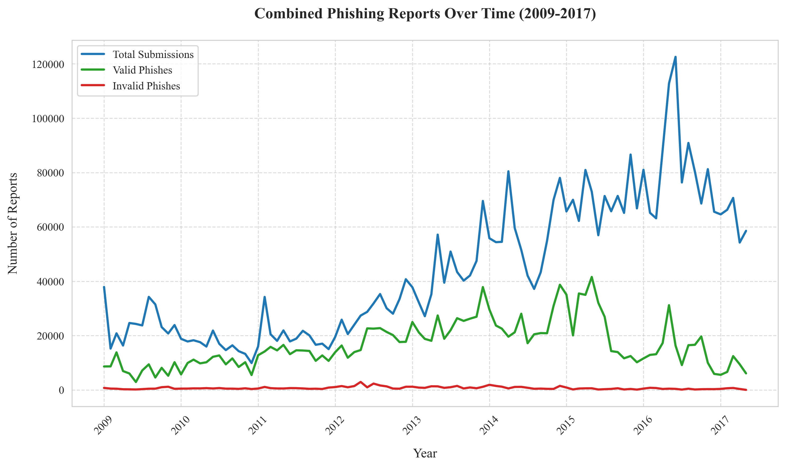
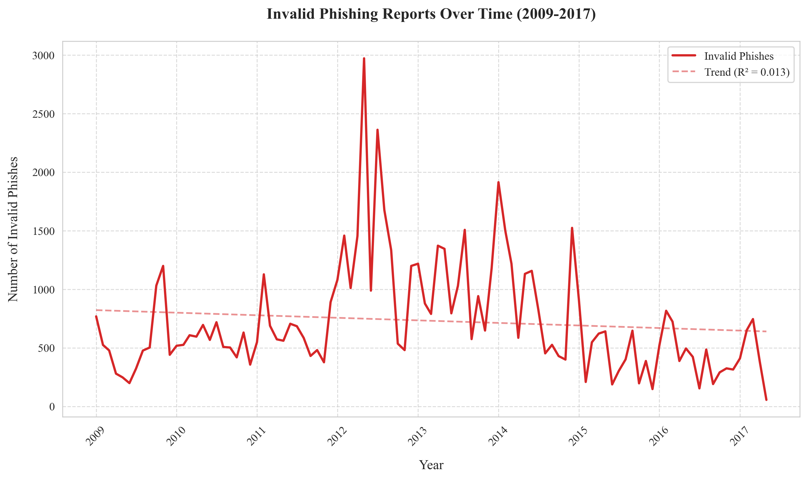
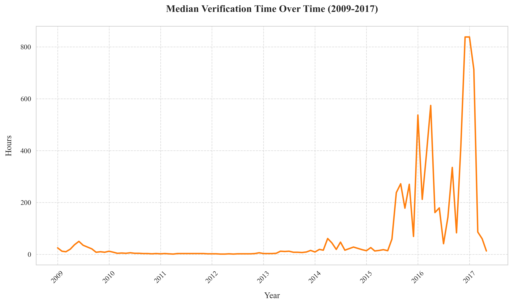
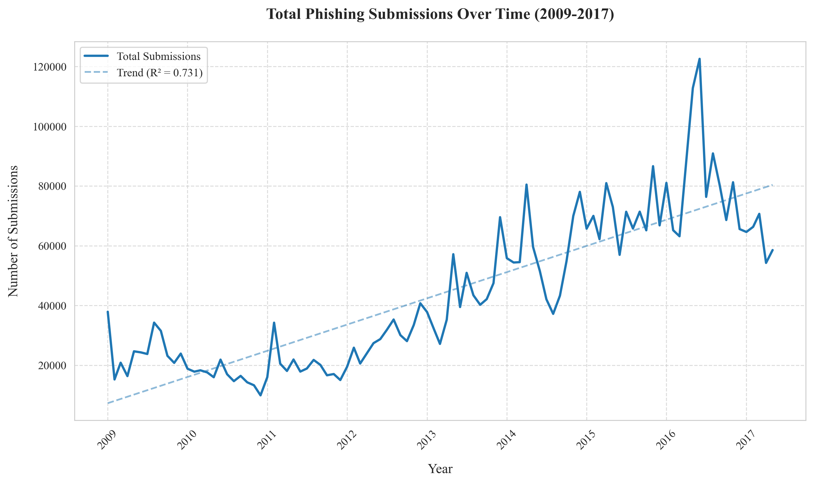
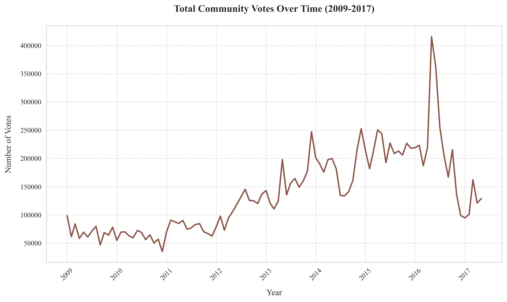
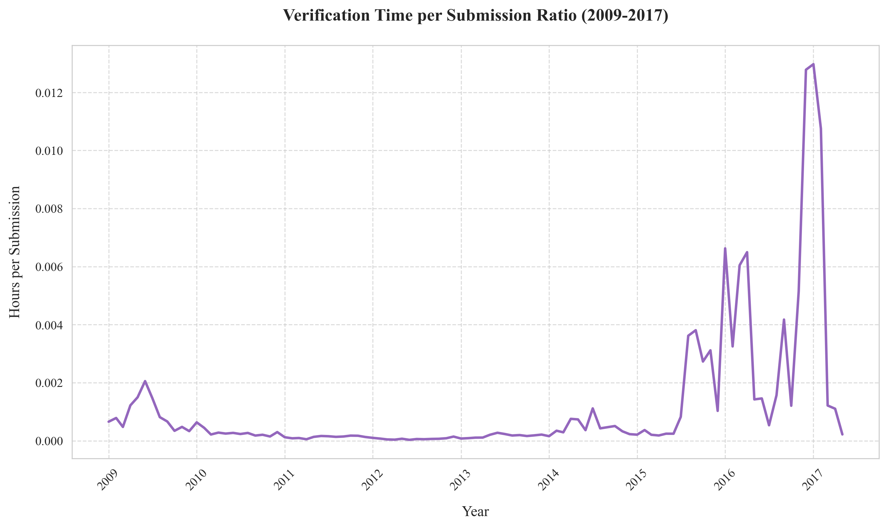
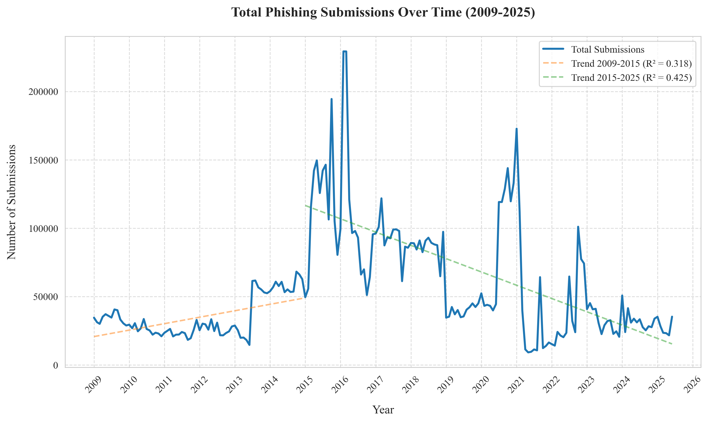
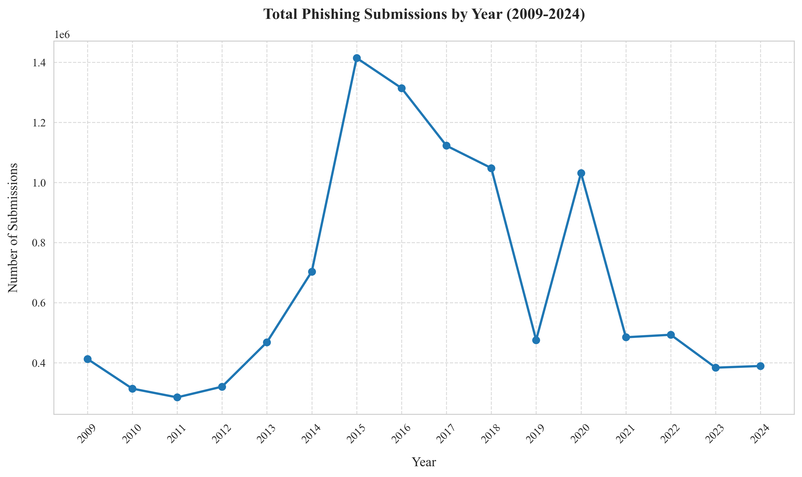
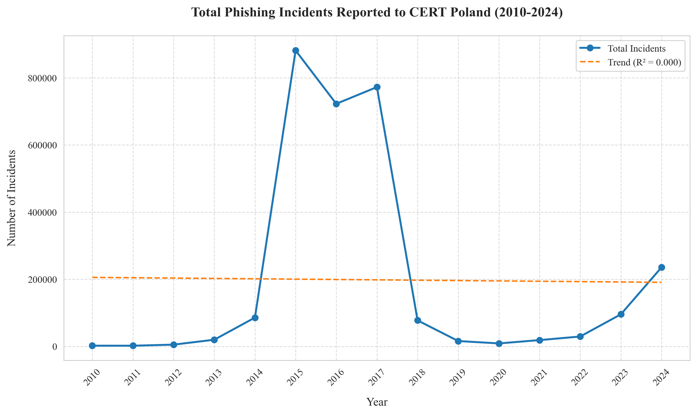
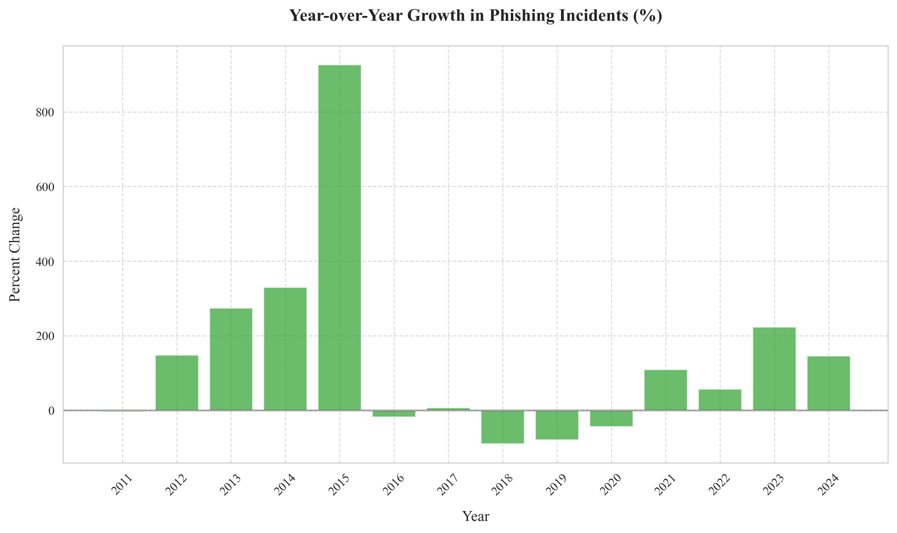

# Phishing Statistics Analysis Project

## Citation

If you use this data or analysis in your research, please cite:

```
Krystian MAGDZIARZ, Military University of Technology, Warsaw, Poland, 2025, https://github.com/krystianmagdziarz/phish-stats
```

## Overview

This project analyzes historical phishing statistics from multiple data sources to understand trends and patterns in phishing attacks over time. The analysis includes data from:

- APWG (Anti-Phishing Working Group) - Monthly phishing activity trends from 2009-2024
- PhishTank - Community-driven phishing verification statistics from 2009-2017
- Polish CERT [Phishing Statistics](https://www.cert.pl/) - Yearly phishing activity trends from 2009-2023

## Data Sources

### APWG Dataset

- Source: [APWG Phishing Activity Trends Reports](https://apwg.org/trendsreports/)
- Time period: 2009-2024
- Metrics: Monthly phishing site detections
- See [APWG README](./apwg/README.md) for more details

### PhishTank Dataset

- Source: PhishTank public statistics
- Time period: 2009-2017
- Metrics: Submissions, verification times, community votes
- See [PhishTank README](./phishtank/README.md) for more details

## Analysis

The project generates various visualizations and statistical analyses:

- Long-term phishing volume trends
- Seasonal patterns in phishing activity
- Community participation metrics
- Verification efficiency metrics

See the individual dataset READMEs for specific analyses and findings.

## Combined Analysis

### PhishTank








### APWG




### Polish CERT




## Usage

Each dataset has its own analysis scripts:

- [APWG Analysis](./apwg/README.md)
- [PhishTank Analysis](./phishtank/README.md)
- [Polish CERT Analysis](./polish-cert/README.md)

## Requirements

- Python 3.8+
- Required packages:
  - matplotlib
  - numpy
  - pandas
  - seaborn
  - scipy

Install dependencies:

```
pip install -r requirements.txt
```
